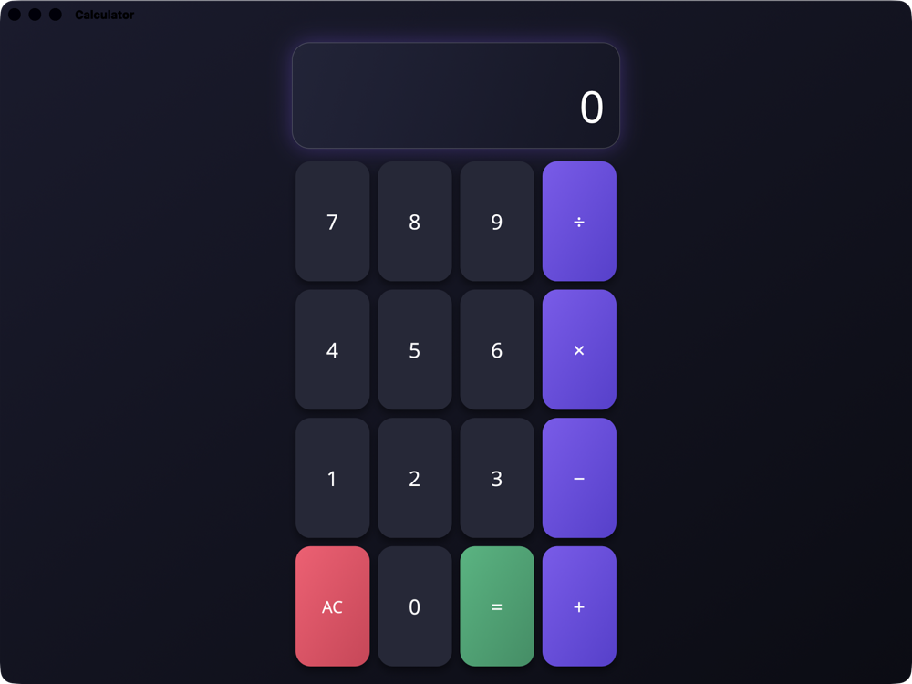

# MAUI Calculator

A simple calculator app built with **.NET MAUI**, with a modern dark design.

<p align="center">
  
</p>

## Features

- Addition `+`, subtraction `−`, multiplication `×` and division `÷`
- Display showing the current operation above the result (e.g. `12 × 3 =`)
- `AC` button to clear everything
- Division by zero shows `Error` instead of crashing
- Typing a number after `=` starts a new calculation
- Dark gradient design with rounded keys, shadows and a small "press" animation

> Note: the calculator works with whole numbers (integers) only.

## Technologies

| Technology | Use |
|---|---|
| **.NET 10** | Framework |
| **.NET MAUI** | Cross-platform UI (one codebase for Mac, iOS, Android, Windows) |
| **C#** | App logic ([MainPage.xaml.cs](Calculator/MainPage.xaml.cs)) |
| **XAML** | User interface ([MainPage.xaml](Calculator/MainPage.xaml)) |
| **XAML Source Generator** | Compiles XAML to C# at build time for faster startup |

The design uses only built-in MAUI controls: `Grid`, `Border`, `Label`, `Button`, `LinearGradientBrush`, `Shadow`, and `VisualStateManager` for the press effect.

## Supported platforms

| Platform | Target framework |
|---|---|
| macOS (Mac Catalyst) | `net10.0-maccatalyst` |
| iOS | `net10.0-ios` |
| Android | `net10.0-android` |
| Windows | `net10.0-windows10.0.19041.0` (when built on Windows) |

## Getting started

### Requirements

- [.NET 10 SDK](https://dotnet.microsoft.com/download)
- The MAUI workload:
  ```bash
  dotnet workload install maui
  ```
- **Mac / iOS:** Xcode
- **Android:** Android SDK (installed with Visual Studio or Android Studio)

### Run the app

```bash
git clone https://github.com/Venki-Sub/MAUI_calculator.git
cd MAUI_calculator/Calculator

# macOS
dotnet build -t:Run -f net10.0-maccatalyst

# Android (emulator or device connected)
dotnet build -t:Run -f net10.0-android
```

You can also open the folder in **VS Code** (with the .NET MAUI extension) or **Visual Studio** and press Run.

## Project structure

```
Calculator/
├── MainPage.xaml        # Calculator UI (display, keypad, styles)
├── MainPage.xaml.cs     # Calculator logic (button clicks, operations)
├── App.xaml(.cs)        # App entry point and global resources
├── AppShell.xaml(.cs)   # App navigation shell
├── MauiProgram.cs       # App setup (fonts, logging)
├── Platforms/           # Platform-specific code (Android, iOS, Mac, Windows)
└── Resources/           # Icons, fonts, images, splash screen, styles
```

## How it works

1. Pressing a number adds it to the display.
2. Pressing an operator saves the first number and the operation, then clears the display.
3. Pressing `=` reads the second number, does the calculation and shows the result.
4. `AC` resets everything.
